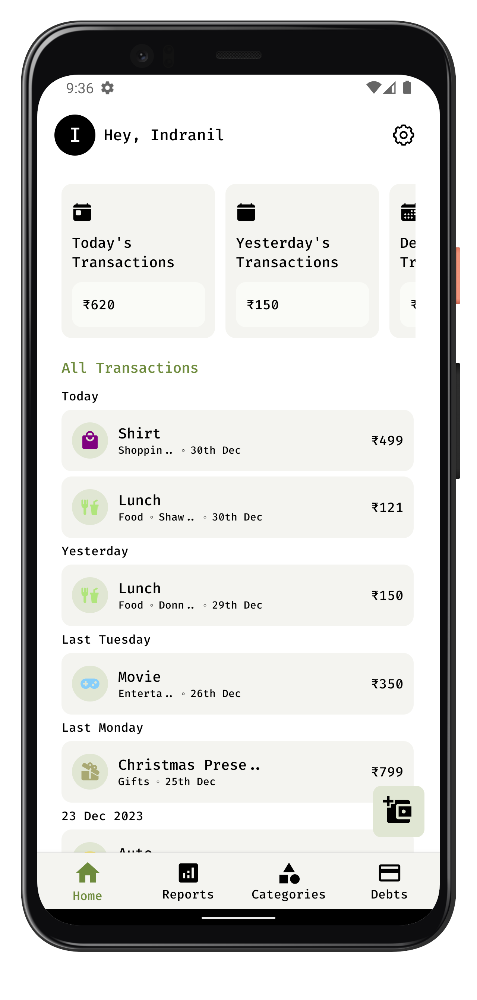

# pietwice Waitlist Website

A beautiful, simple, and trustworthy waitlist landing page for pietwice expense manager app. Built to be hosted on Firebase Hosting.

## Quick Start

1. **Copy screenshots:**
   ```bash
   cd waitlist
   bash copy-screenshots.sh
   ```

2. **Set up Firebase:**
   ```bash
   npm install -g firebase-tools
   firebase login
   firebase init hosting
   ```

3. **Configure Firebase SDK in `script.js`** (get config from Firebase Console)

4. **Deploy:**
   ```bash
   firebase deploy --only hosting
   ```

Your waitlist page will be live! See detailed instructions below.

## Features

- ✨ Modern, responsive design matching pietwice branding
- 🌓 Dark mode support (automatic based on system preference)
- 📱 Mobile-friendly layout
- 🔒 Privacy-first messaging
- ⚡ Fast loading with optimized assets
- 📧 Email collection with Firebase Firestore integration
- 🎨 Beautiful UI with smooth animations

## Project Structure

```
waitlist/
├── index.html          # Main HTML file
├── styles.css          # All styles (light & dark themes)
├── script.js           # Form handling and Firebase integration
├── firebase.json       # Firebase hosting configuration
├── .firebaserc         # Firebase project configuration
├── .gitignore          # Git ignore rules
└── README.md           # This file
```

## Setup Instructions

### Prerequisites

1. **Node.js** (v18 or higher)
2. **Firebase CLI** - Install globally:
   ```bash
   npm install -g firebase-tools
   ```

### Step 1: Create Firebase Project

1. Go to [Firebase Console](https://console.firebase.google.com/)
2. Click "Add project" or select an existing project
3. Follow the setup wizard
4. Enable **Firestore Database**:
   - Go to Firestore Database in the sidebar
   - Click "Create database"
   - Start in **test mode** (we'll secure it later)
   - Choose a location close to your users

### Step 2: Configure Firebase Hosting

1. **Login to Firebase CLI:**
   ```bash
   firebase login
   ```

2. **Initialize Firebase in the waitlist directory:**
   ```bash
   cd waitlist
   firebase init hosting
   ```

3. **Follow the prompts:**
   - Select "Use an existing project" and choose your Firebase project
   - Set public directory as `.` (current directory)
   - Configure as single-page app: **Yes**
   - Set up automatic builds: **No** (unless using CI/CD)

4. **Update `.firebaserc`:**
   ```json
   {
     "projects": {
       "default": "your-actual-firebase-project-id"
     }
   }
   ```

### Step 3: Set Up Firestore for Waitlist Emails

1. **Create Firestore Collection:**
   - Go to Firestore Database in Firebase Console
   - Click "Start collection"
   - Collection ID: `waitlist`
   - Document ID: Auto-generate
   - Add fields:
     - `email` (string) - required
     - `timestamp` (timestamp) - required
     - `source` (string) - optional (e.g., "website")
     - `status` (string) - optional (e.g., "pending")

2. **Set up Security Rules:**
   Go to Firestore → Rules and update:
   ```javascript
   rules_version = '2';
   service cloud.firestore {
     match /databases/{database}/documents {
       match /waitlist/{document} {
         // Allow anyone to add to waitlist
         allow create: if request.resource.data.email is string
                    && request.resource.data.email.matches('.*@.*\\..*');
         // Only allow reading your own data (or restrict completely)
         allow read: if false;
         // Prevent updates/deletes
         allow update, delete: if false;
       }
     }
   }
   ```

### Step 4: Configure Firebase SDK in script.js

1. **Get your Firebase config:**
   - Go to Firebase Console → Project Settings → General
   - Scroll down to "Your apps" section
   - Click the web icon (`</>`) to add a web app
   - Copy the `firebaseConfig` object

2. **Update `script.js`:**
   - Uncomment the Firebase import statements at the top
   - Replace the `firebaseConfig` object with your actual config
   - The `submitToFirestore` function will now work

### Step 5: Set Up Screenshots

The waitlist page references screenshots from `../assets/screenshots/`. You have two options:

**Option A: Copy screenshots to waitlist folder (Recommended)**
```bash
# From project root
mkdir -p waitlist/assets/screenshots
cp assets/screenshots/*.png waitlist/assets/screenshots/
```

Then update `index.html` to use:
```html

```

**Option B: Keep screenshots in parent directory**
If deploying from the `waitlist/` folder, update `firebase.json` to include the parent assets folder, or use absolute URLs if hosting screenshots on a CDN.

**Option C: Use placeholder images**
Replace screenshot paths with placeholder images or remove the screenshot section temporarily.

### Step 6: Deploy to Firebase

```bash
firebase deploy --only hosting
```

Your waitlist page will be live at:
`https://your-project-id.web.app` or `https://your-project-id.firebaseapp.com`

### Step 7: Set Up Custom Domain (Optional)

1. Go to Firebase Console → Hosting
2. Click "Add custom domain"
3. Follow the instructions to verify domain ownership
4. Update DNS records as instructed

## Alternative: Using Cloud Functions

If you prefer using Cloud Functions instead of direct Firestore access:

### 1. Create Cloud Function

Create `functions/index.js`:

```javascript
const functions = require('firebase-functions');
const admin = require('firebase-admin');
admin.initializeApp();

exports.addToWaitlist = functions.https.onRequest(async (req, res) => {
  // Enable CORS
  res.set('Access-Control-Allow-Origin', '*');
  
  if (req.method === 'OPTIONS') {
    res.set('Access-Control-Allow-Methods', 'POST');
    res.set('Access-Control-Allow-Headers', 'Content-Type');
    res.status(204).send('');
    return;
  }

  if (req.method !== 'POST') {
    return res.status(405).json({ error: 'Method not allowed' });
  }

  const { email } = req.body;

  if (!email || !/^[^\s@]+@[^\s@]+\.[^\s@]+$/.test(email)) {
    return res.status(400).json({ error: 'Invalid email' });
  }

  try {
    const docRef = await admin.firestore().collection('waitlist').add({
      email: email.toLowerCase().trim(),
      timestamp: admin.firestore.FieldValue.serverTimestamp(),
      source: 'website',
      status: 'pending'
    });

    return res.status(200).json({ 
      success: true, 
      id: docRef.id 
    });
  } catch (error) {
    console.error('Error adding to waitlist:', error);
    return res.status(500).json({ error: 'Internal server error' });
  }
});
```

### 2. Update script.js

Uncomment and configure the `submitToCloudFunction` function with your Cloud Function URL.

### 3. Deploy Function

```bash
firebase deploy --only functions
```

## Customization

### Colors

Edit CSS variables in `styles.css`:

```css
:root {
  --accent-green: #6E8B3D;  /* Primary brand color */
  --primary-bg: #FFFFFF;     /* Light theme background */
  /* ... */
}
```

### Content

Edit text content in `index.html`:
- Hero section text
- Feature descriptions
- Footer text

### Screenshots

Replace screenshot images in the `screenshots-preview` section with your actual app screenshots.

## Testing Locally

1. **Install Firebase CLI tools** (if not already installed)
2. **Serve locally:**
   ```bash
   firebase serve --only hosting
   ```
3. **Open in browser:**
   ```
   http://localhost:5000
   ```

## Monitoring Waitlist Signups

1. Go to Firebase Console → Firestore Database
2. View the `waitlist` collection
3. See all signups with timestamps
4. Export data: Click the three dots → Export collection

## Analytics (Optional)

Add Google Analytics:

1. Get your Google Analytics tracking ID
2. Add to `index.html` before `</head>`:
   ```html
   <!-- Google Analytics -->
   <script async src="https://www.googletagmanager.com/gtag/js?id=GA_MEASUREMENT_ID"></script>
   <script>
     window.dataLayer = window.dataLayer || [];
     function gtag(){dataLayer.push(arguments);}
     gtag('js', new Date());
     gtag('config', 'GA_MEASUREMENT_ID');
   </script>
   ```

## Troubleshooting

### Form not submitting
- Check browser console for errors
- Verify Firebase config is correct
- Check Firestore security rules
- Ensure Firestore is enabled in Firebase Console

### Screenshots not loading
- Verify image paths are correct
- Check that images exist in the specified location
- For Firebase hosting, ensure images are in the public directory

### Styling issues
- Clear browser cache
- Check CSS file is loading correctly
- Verify no conflicting styles

## Security Best Practices

1. **Firestore Rules:** Always restrict read access to waitlist collection
2. **Rate Limiting:** Consider adding rate limiting to prevent spam
3. **Email Validation:** Already implemented client-side, but validate server-side too
4. **HTTPS:** Firebase Hosting automatically uses HTTPS

## Support

For issues or questions:
- Check Firebase documentation: https://firebase.google.com/docs
- Review Firestore security rules: https://firebase.google.com/docs/firestore/security/get-started

## License

Same license as the main pietwice project.
